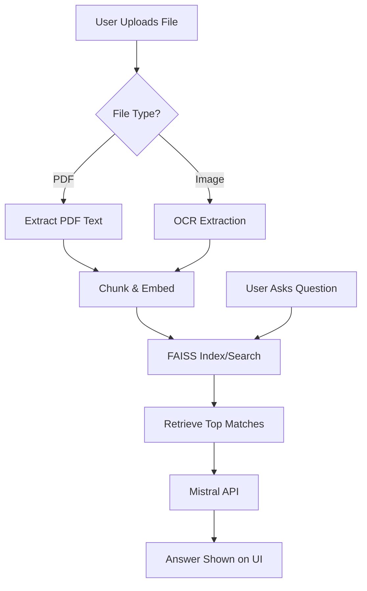

# InsightVision

  

> InsightVision is a lightweight, cloud-deployable document understanding tool that extracts content from PDFs or images, semantically indexes it using embeddings, and allows LLM-powered question answering using Mistral.

---

## 🚀 Features

- 📄 PDF and 🖼️ image (OCR) support
- 🔍 FAISS-based vector search for semantic matching
- 🤖 Mistral LLM integration for intelligent answers
- 🧠 Smart OCR fallback and captioning-ready design
- ☁️ Dockerized & deployable on GCP (Cloud Run)
- 🖥️ Streamlit frontend

---

## 📦 Folder Structure

```bash
insightvision/
├── app/
│   ├── main.py                  # Streamlit frontend
│   ├── config.py                # Environment setup
│   ├── services/
│   │   ├── extract/             # PDF and image handlers
│   │   ├── vectorstore/         # Chunking, embedding, FAISS
│   │   └── llm/                 # Mistral API integration
│   ├── routes/                  # (Optional FastAPI backend)
│   ├── utils/                   # file_ops, helpers
├── models/                     # Pre-downloaded embedding model
├── data/                       # Uploaded files + FAISS index
├── .env                        # API keys and configs
├── Dockerfile
├── requirements.txt
├── README.md
└── run_local.sh
```

---

## 🧠 Project Workflow (Mermaid)



---

## 🛠️ Setup Instructions

### 1. Clone the Repo
```bash
git clone https://github.com/yourusername/InsightVision.git
cd InsightVision
```

### 2. Setup Environment
```bash
python -m venv venv
source venv/bin/activate  # or venv\Scripts\activate on Windows
pip install -r requirements.txt
```

### 3. Add `.env`
```env
MISTRAL_API_KEY=your-api-key
UPLOAD_DIR=data/uploads
INDEX_PATH=data/vectorstore/index.faiss
EMBEDDING_MODEL=all-MiniLM-L6-v2
```

### 4. Run Locally
```bash
streamlit run app/main.py
```

---

## 🐳 Docker Instructions

### Build Locally
```bash
docker build -t insightvision .
```

### Run Locally
```bash
docker run -p 8080:8080 --env-file .env insightvision
```

### Deploy to GCP
```bash
gcloud run deploy insightvision \
  --image us-central1-docker.pkg.dev/YOUR_PROJECT/insightvision-repo/insightvision \
  --platform managed \
  --region us-central1 \
  --allow-unauthenticated \
  --port 8080 \
  --memory 1Gi \
  --set-env-vars MISTRAL_API_KEY=your-key
```

---

## 🤝 Future Enhancements
- 🔄 Add support for BLIP-based image captioning
- 🧩 Plug-in integration for LangChain or ChromaDB
- 🧠 Citation generation using RAG
- 🗂️ Multi-file ingestion and Q&A

---

## 📄 License

MIT License. Use freely and contribute back!

---
